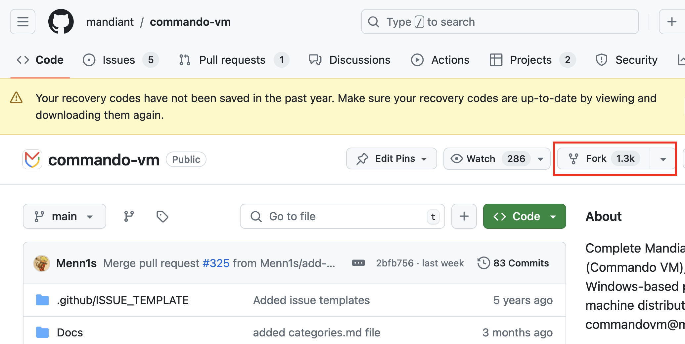
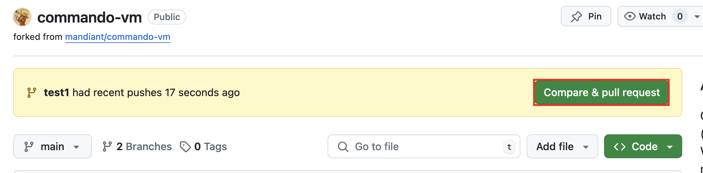

The goal of this guide is to get **anyone** who would like to contribute to the project get started, even with minimal experience with Git. 

This guide does not assume prior experience of contributing to Github projects, because a large number of those performing, learning, or researching offensive security may not have had many experiences working on projects with multiple contributors.

To get started with the project, there are a couple key points a contributor will need to understand first:
- CommandoVM is built using a combination of **Chocolatey, Boxstarter, and some custom powershell scripts**. Boxstarter allows installations to continue on reboot (since some package installations may require restarts to work properly), and **Chocolatey** is similar to package managers such as apt, brew, or yum.
- All of the packages used for Commando can be found in the **[vm-packages](https://github.com/mandiant/VM-Packages)** repository. These are then built and pushed to a public package feed on MyGet, which is where Chocolatey goes to fetch the packages. The VM-Packages repository supports other Mandiant virtual machine projects as well, such as [FlareVM](https://github.com/mandiant/flare-vm).
- The **VM-packages [wiki](https://github.com/mandiant/VM-Packages/wiki)** contains great information on contributing to the VM-packages repo.

## What areas need work?
### CommandoVM
There are a couple areas that will need work and regular maintenance. On the **CommandoVM** side, there can be improvements made to:
- the installer. While this is mostly static, certain logic may change as Windows changes, such as certain locations of registry keys. Search for `Installer Functions` around line `932` to begin seeing the functions that contribute to installation logic (the section above handles GUI elements). [installer.ps1](https://github.com/mandiant/commando-vm/blob/main/install.ps1)

- updating installation profiles with new tools. This ensures the latest packages are available and appropriate for the job at hand: offensive security. See the available [profiles](https://github.com/mandiant/commando-vm/tree/main/Profiles).

On top of all this, regular bugs, issues, and improvement recommendations are also provided by the community on the Github page.

### VM-Packages
Many issues have to do with missing packages or packages that fail to install because they are outdated or their installation paths have changed. For those issues, improvements and additions can be made to the **VM-Packages** repository. For more information on adding, testing, and fixing packages, see the **VM-packages [wiki](https://github.com/mandiant/VM-Packages/wiki)**

One major effort maintained here is the `debloat.vm` package that performs the cleanup of a fresh Windows VM, greatly reducing resources consumed (as well as general eye strain). The package can be found here: [debloat.vm](https://github.com/mandiant/VM-Packages/tree/main/packages/debloat.vm)

Another significant part of the project is the **common.vm** package. It helps provide a set of standardized powershell helper functions across Mandiant VMs and provides a method for customization through environment variables. Additional information can be found here [common.vm readme](https://github.com/mandiant/VM-Packages/tree/main/packages/common.vm) and the code is here in the [Common.vm Powershell Module](https://github.com/mandiant/VM-Packages/blob/main/packages/common.vm/tools/vm.common/vm.common.psm1).

## Contributing to VM-Packages
For more information on adding, testing, and fixing packages, see the **VM-packages [wiki](https://github.com/mandiant/VM-Packages/wiki)** and specifically the "**My first package [walk through](https://github.com/mandiant/VM-Packages/wiki/My-first-package-walk-through)**" 

I highly recommend referring to recently closed PRs and newly added packages to get a good idea of how packages are structured.
## Contributing to CommandoVM
This section covers the workflow for making a contribution to Commando VM. 

**1.** Create a fork of the repository in your Github account
> 

**2.** Clone the repository to your development computer 
```
git clone https://github.com/<your-username>/commando-vm
```
- Change directory into the newly cloned directory
```
cd commando-vm
```
- (Optional) set the remote upstream repository so you can keep your clone up to date.
```
git remote add upstream https://github.com/mandiant/commando-vm
```


**3.** Create and checkout a branch for the change
```
git checkout -b <update/fix-for-something>
```

**4.** Make the changes. Add and commit regularly so the comments are descriptive and helpful. Larger commits can be confusing to review.
- After making changes, first stage the changed files.
```
git add .
```
- Commit the changes with a message for each change.
```
git commit -m "This is a change"
```
- Repeat as needed.

**5.** Then push those commits to your fork of Commando VM. This will upload the changes to your Github repository.
```
git push --set-upstream origin <branch-name>
```

**6.** Create a Pull Request to integrate the changes into the Mandiant repository of Commando VM.
- Navigate to your cloned repository
- Use the "Compare & pull request" button to create a pull request. Fill out the title and details about what was changed and the Mandiant team will either approve and merge the change or comment with questions/requested changes.
> 

**7.** Next time you want to use your cloned repository, make sure it is up to date with the following commands:
- `git fetch upstream` to get the upstream changes locally.
- `git checkout main` to select your main branch of the cloned fork.
- `git merge upstream/main` merge the upstream changes with your version.
- `git add .` to stage the changed files after the merge (resolve conflicts first if necessary)
- `git commit` to commit the changes
- `git push origin main` to update the remote fork with changes from the upstream repository
