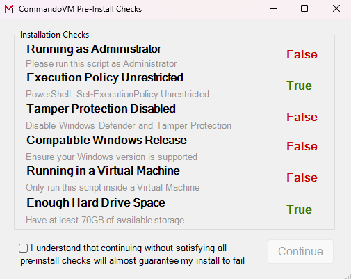
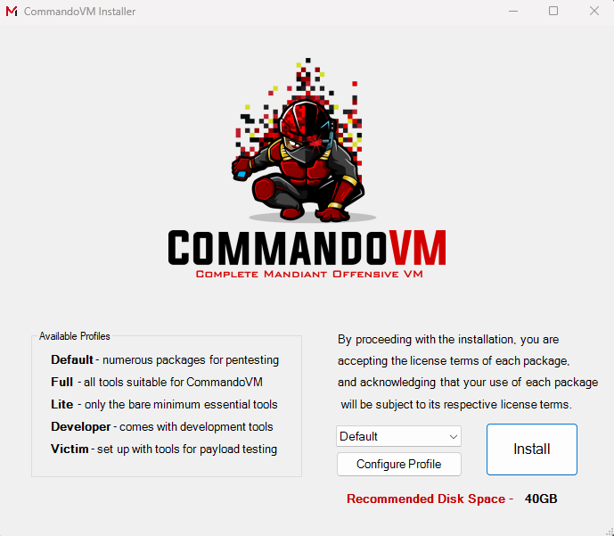

# Troubleshooting the Install

This page lists the full steps necessary to install CommandoVM, with any additional information that might help you troubleshoot your issues:
- [Requirements](#requirements)
- [Pre-Install Steps](#pre-install-steps)
- [Graphical Install](#graphical-install)
- [Command-Line Install](#command-line-install)

## CommandoVM Requirements

- Windows 10 22H2
- Windows 11 TBA
- Minimum 70 GB Hard Drive
- Minimum 4 GB RAM

## Pre-Install Steps

**Disclaimer**
> The installer will not allow you to continue until you satisfy these requirements. You may skip them by passing the `-skipChecks` flag if you know what you are doing, but we do not recommend it.

### Supported Operating System

CommandoVM currently supports Windows 10 22H2 (19045).

### Running in a Virtual Machine

You should never install CommandoVM on your host machine. CommandoVM makes irreversible changes to the system that you cannot uninstall. We recommend installing it on a virtual machine in VirtualBox or VMWare.

### Storage Requirement

Windows itself takes up significant space on disk and CommandoVM installs a large number of additional packages and tools. Ensure that you have at least **70GB** of storage in your VM. If you opt-in to install the **Full** CommandoVM profile, you will want approximately 110 GB.

### Running as Administrator

CommandoVM uses Chocolatey and Boxstarter to install its packages. Installing packages requires Administrator rights, so you must run your terminal as Administrator as shown on the image below.


### PowerShell Execution Policy

By default PowerShell restricts scripts from being loaded on Windows Workstations and requires them to be signed by a trusted publisher on Windows servers. CommandoVM installation is performed using PowerShell, so you need to disable these restrictions using the following PowerShell command from an elevated prompt:
```powershell
Set-ExecutionPolicy Unrestricted
```

### PowerShell `Unblock-File`
Whenever you download files from the internet, Windows places a "Mark of the Web" identifier on them. Scripts within this repository need to be unblocked so that they can run automatically and not cause issues with the install after clicking the "Go" button.

### Windows Defender and Tamper Protection

In the past CommandoVM would try to programmatically disable Windows Defender for you. Unfortunately Windows Defender is constantly evolving, so we cannot keep up with the changes. You **must** disable Windows Defender and Tamper Protection manually before starting the install. It is not enough to simply disable Real-Time Protection, because **it will become re-enabled after a reboot**.

See the following links for the latest methods of disabling it known to us on Windows 10 and 11:
- [Windows 10](https://superuser.com/questions/1757339/how-to-permanently-disable-windows-defender-real-time-protection-with-gpo)
- [Windows 11](https://www.makeuseof.com/permanently-disable-microsoft-defender-windows-11/)

> **WARNING:** If you do not properly disable Windows Defender, your installation will most certainly fail

## Graphical Install

First, download the CommandoVM repo from GitHub either as a ZIP, or using `git` from PowerShell if you have it installed already:
```powershell
git clone https://github.com/mandiant/commando-vm.git
```

Next, run an elevated terminal and navigate to the folder where you cloned CommandoVM files. Once inside, run the `install.ps1` script:
```powershell
.\install.ps1
```

The pre-install checks menu will open. Make sure you go through the [Pre-Install Steps](#pre-install-steps) section of this page to ensure you pass all of them. The installer will not allow you to click "Continue" until the checks are satisfied or you override them. 

> **WARNING:** Do not override the checks if you have no idea why they are failing



Once you pass all the pre-install checks, the main installer window will open. If you wish to customize your install and change what packages are installed, see the [Customization](Customization.md) documentation page. Otherwise, select a profile from the dropdown menu and click "Install".



You will get a password prompt for Boxstarter. If you do not have a password set or your password is blank, click "OK" without entering anything. Otherwise, enter your password into the textbox and click "OK".


The installer GUI will now close and the installation will start. You may monitor its progress inside the terminal window you used to launch the install script. During this time your system will restart multiple times. You will know that installation is finished when your background image gets changed to the Commando logo. 

Installation may take over an hour, depending on the specs of the target virtual machine.

> **WARNING:** CommandoVM is not a fully-unattended install. You need to monitor the install progress for any failures or errors.

## Command-Line Install

First, download the CommandoVM repo from GitHub either as a ZIP, or using `git` from PowerShell if you have it installed already:
```powershell
git clone https://github.com/mandiant/commando-vm.git
```

The CommandoVM CLI install is non-interactive. You will need to pass several flags for it to start properly:
- `-cli` - required to avoid spawning the GUI installer
- `-customProfile` - path to an XML profile. See [Customization](Customization.md) for the format.
- `-noPassword` - if your user does not have a password set or the password is blank, pass this flag
- `-password` - if your password is not blank, pass it to the installer using this flag

Here is an example of how you can install the default profile without a password:
```powershell
.\install.ps1 -cli -customProfile .\Profiles\Default.xml -noPassword
```

Here is an example of how you can install the default profile with a password:
```powershell
.\install.ps1 -cli -customProfile .\Profiles\Default.xml -password "Summer2023!"
```

The the installation will now start. During this time your system will restart multiple times. Installation may take over an hour, depending on the specs of the target virtual machine.

> **WARNING:** CommandoVM is not a fully-unattended install. You need to monitor the install progress for any failures or errors.
