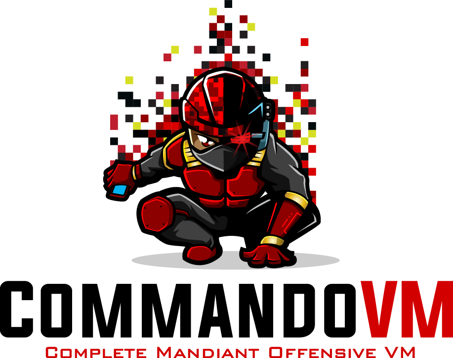

## What is CommandoVM?

**Complete Mandiant Offensive VM ("CommandoVM")** is a comprehensive and customizable, Windows-based security distribution for penetration testing and red teaming. CommandoVM comes packaged with a variety of offensive tools not included in [Kali Linux](https://www.kali.org/), which are focused on attacking Windows, Active Directory and the Azure Cloud.

### What are 3.0's key features?

- TBA

## Quick Start Guide

1) Deploy a Win 10 22H2 or Win 11 22621 VM with a 100GB disk
2) Follow these steps ([Win 10](https://superuser.com/questions/1757339/how-to-permanently-disable-windows-defender-real-time-protection-with-gpo) | [Win 11](https://www.makeuseof.com/permanently-disable-microsoft-defender-windows-11/)) to disable Windows Defender
3) Download and extract the zip of the Commando-VM repo
4) Run PowerShell as Administrator
5) `Set-ExecutionPolicy Unrestricted -force`
6) `cd ~/Downloads/commando-vm`
7) `Unblock-File install.ps1`
8) `.\install.ps1` for a GUI install or `.\install.ps1 -cli` for command-line

## Documentation Pages

- [Packages](Docs/Packages.md) - full list of packages for each default profile
- [Customization](Docs/Customization.md) - how to customize your CommandoVM install
- [Troubleshooting](Docs/Troubleshooting.md) - detailed steps to avoid install issues
- [Changelog](Docs/Changelog.md) - history of changes to CommandoVM
- [Contributing](Docs/Contributing.md) - how to request packages and share feedback

## Credits

- Jake Barteaux     @day1player
- Blaine Stancill   @MalwareMechanic
- Nhan Huynh        @htnhan
- Drew Farber       @0xFarbs
- Alex Tselevich    @nos3curity
- George Litvinov   @geo-lit
- Dennis Tran       @Menn1s
- Derrick Tran      @dumosuku
- Mandiant Red Team
- Mandiant FLARE

## Legal Notice

```
This download configuration script is provided to assist penetration testers
in creating handy and versatile toolboxes for offensive engagements. It provides 
a convenient interface for them to obtain a useful set of pentesting Tools directly 
from their original sources. Installation and use of this script is subject to the 
Apache 2.0 License.
 
You as a user of this script must review, accept and comply with the license
terms of each downloaded/installed package listed below. By proceeding with the
installation, you are accepting the license terms of each package, and
acknowledging that your use of each package will be subject to its respective
license terms.
```
