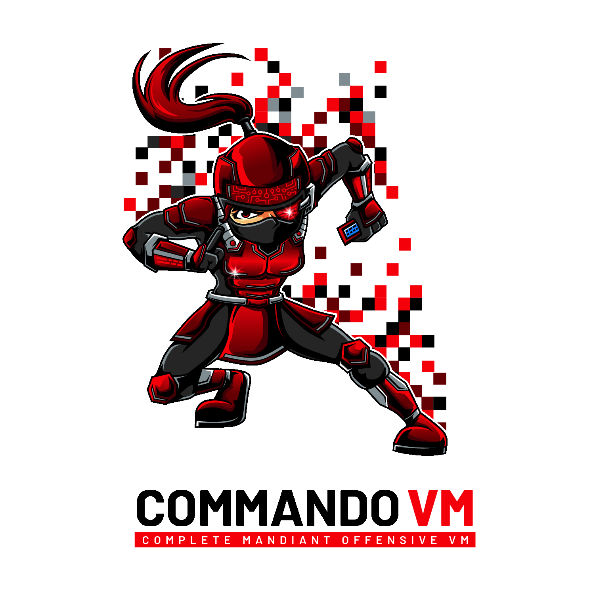

## What is CommandoVM?

**Complete Mandiant Offensive VM ("CommandoVM")** is a comprehensive and customizable, Windows-based security distribution for penetration testing and red teaming. CommandoVM comes packaged with a variety of offensive tools not included in [Kali Linux](https://www.kali.org/) which highlight the effectiveness of Windows as an attack platform.

## Requirements
* Windows 10
> Insider Preview editions of Windows are not supported
* 60 GB Hard Drive
* 2 GB RAM

## Recommended
* Windows 10 22H2
* 80+ GB Hard Drive
* 4+ GB RAM
* 2 network adapters

# Install Instructions
Deploy a Windows Virtual Machine
   > [Where can I find a Windows 10 Virtual Machine?](https://www.microsoft.com/en-us/software-download/windows10ISO)

## Pre-Install Procedures
**You MUST disable Windows Defender for a smooth install**. The best way to accomplish this is through Group Policy.

In Windows versions 1909 and higher, Tamper Protection was added.
**Tamper Protection must be disabled first, otherwise Group Policy settings are ignored.**

1. Open Windows Security (type `Windows Security` in the search box)
1. Virus & threat protection > Virus & threat protection settings > Manage settings
1. Switch `Tamper Protection` to `Off` 
> It is not necessary to change any other setting (`Real Time Protection`, etc.)

> **Important!** Tamper Protection must be disabled before changing Group Policy settings.

To permanently disable Real Time Protection:

1. Make sure you disabled Tamper Protection
1. Open Local Group Policy Editor (type `gpedit` in the search box)
1. Computer Configuration > Administrative Templates > Windows Components > Microsoft Defender Antivirus > Real-time Protection
1. Enable `Turn off real-time protection`
1. **Reboot**
> Make sure to **reboot** before making the next change

To permanently disable Microsoft Defender:

1. Make sure you rebooted your machine
1. Open Local Group Policy Editor (type `gpedit` in the search box)
1. Computer Configuration > Administrative Templates > Windows Components > Microsoft Defender Antivirus
1. Enable `Turn off Microsoft Defender Antivirus`
1. **Reboot**

  [1]: https://stackoverflow.com/questions/62174426/how-to-permanently-disable-windows-defender-real-time-protection-with-gpo

## Installation 
1. Complete the pre-install procedures by disabling Defender
1. Download and extract the zip of the Commando-VM repo
1. Run PowerShell as Administrator
1. `Set-ExecutionPolicy Unrestricted -force`
1. `cd ~/Downloads/commando-vm`
1. `Get-ChildItem .\ -Recurse | Unblock-File`
1. `.\install.ps1` for a GUI install or `.\install.ps1 -cli` for command-line


## Contributing
Looking to contribute? Check the links below to learn how!

### Commando-VM (this repository)
- See our quick start guide to go from zero to Commando ASAP! [https://github.com/mandiant/commando-vm/blob/main/Docs/Commando_Quickstart_Guide.md](https://github.com/mandiant/commando-vm/blob/main/Docs/Commando_Quickstart_Guide.md)

### VM-Packages (where all the packages live)
* [Repository of all tool packages (VM-packages)](https://github.com/mandiant/VM-Packages)
* [Documentation and contribution guides for tool packages](https://github.com/mandiant/VM-Packages/wiki)
* [Submit new tool packages or report package related issues](https://github.com/mandiant/VM-Packages/issues)

## Troubleshooting
See the  for more information.

## Credits

- Jake Barteaux         @day1player
- Blaine Stancill       @MalwareMechanic
- Nhan Huynh            @htnhan
- Drew Farber           @0xFarbs
- Alex Tselevich        @nos3curity
- George Litvinov       @geo-lit
- Dennis Tran           @Menn1s
- Joseph Clay           @skollr34p3r
- Ana Martinez Gomez    @anamma_06
- Moritz Raabe
- Derrick Tran          @dumosuku
- Mandiant Red Team
- Mandiant FLARE

## Legal Notice

```
This download configuration script is provided to assist penetration testers
in creating handy and versatile toolboxes for offensive engagements. It provides 
a convenient interface for them to obtain a useful set of pentesting Tools directly 
from their original sources. Installation and use of this script is subject to the 
Apache 2.0 License.
 
You as a user of this script must review, accept and comply with the license
terms of each downloaded/installed package listed below. By proceeding with the
installation, you are accepting the license terms of each package, and
acknowledging that your use of each package will be subject to its respective
license terms.
```
